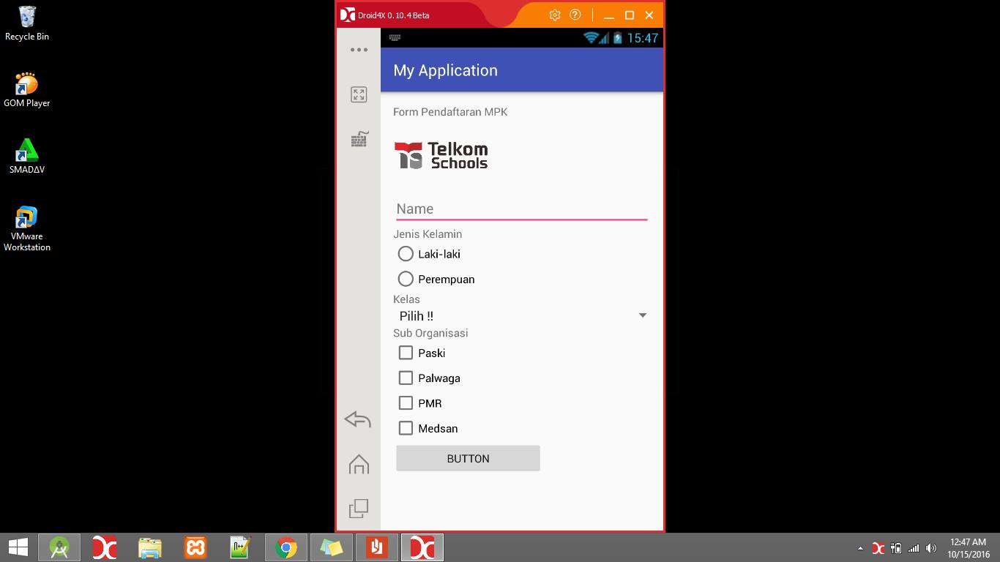
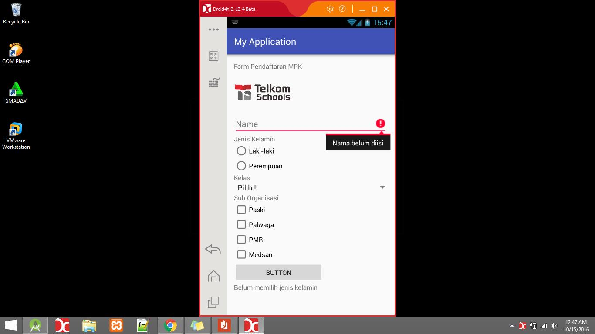
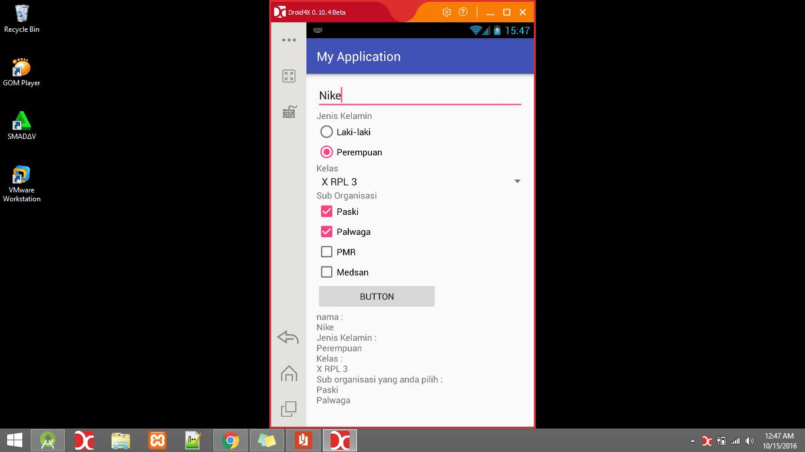

# Pendarftaran-MPK
Penjelasan Aplikasi

* Tema aplikasi : Pendaftaran Organisasi MPK di SMK Telkom Malang

* Pengisian :
  1. Edit Text yang digunakan untuk mengisikan nama
  2. Check Box yang digunakan untuk memilih SUB Organisasi yang diikuti oleh peserta 
  3. Radio Button yang digunakan untuk memilih jenis kelamin
  4. Spinner yang digunakan untuk memilih kelas calon peserta 
  
* Validasi Form Ketika kita belum mengisi nama maka akan keluar pesan pada edit text
* Aplikasi ini untuk peserta yang ingin daftar organisasi MPK
* Screenshot Aplikasi

* Link Aplikasi
[apk](https://drive.google.com/file/d/0B3KB_ZamJvT_aGttRUFhVV9xRWM/view)
* Identitas 
  - Nama : Nike Ayu Valentina
  - Kelas : XIIR5
  - No Urut : 28
  - NIS : 4400/1298-070
  - Nama Sekolah :Telkom School, Malang
